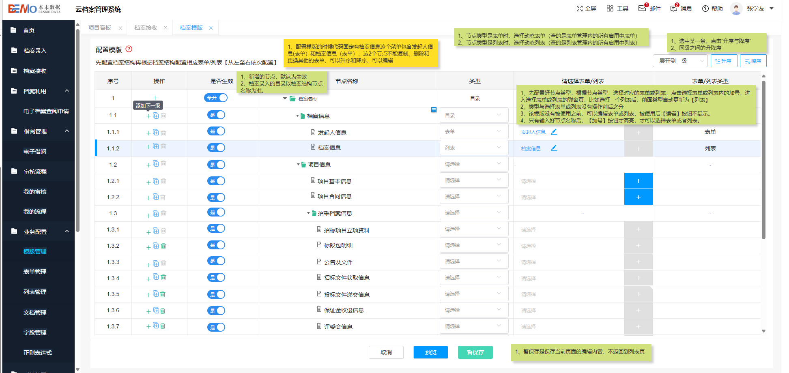
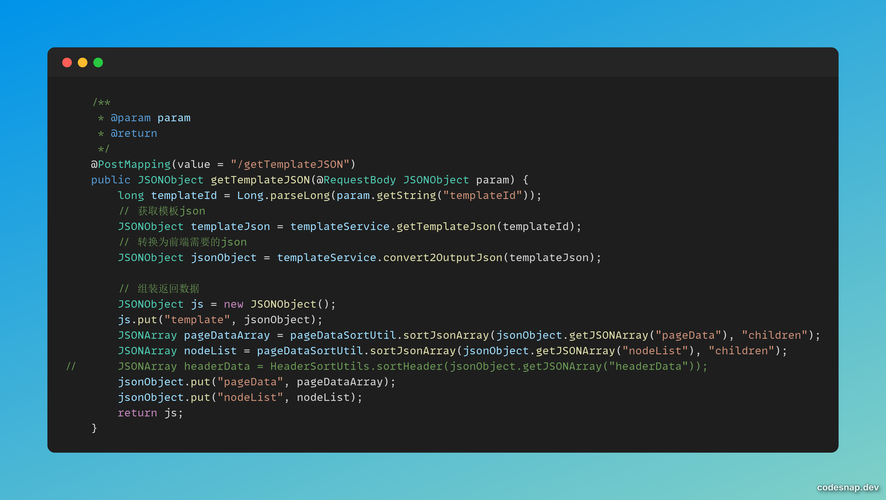
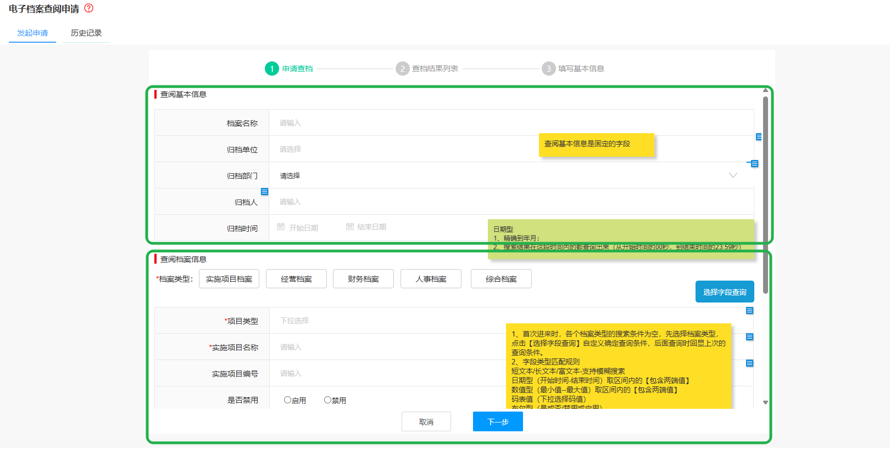
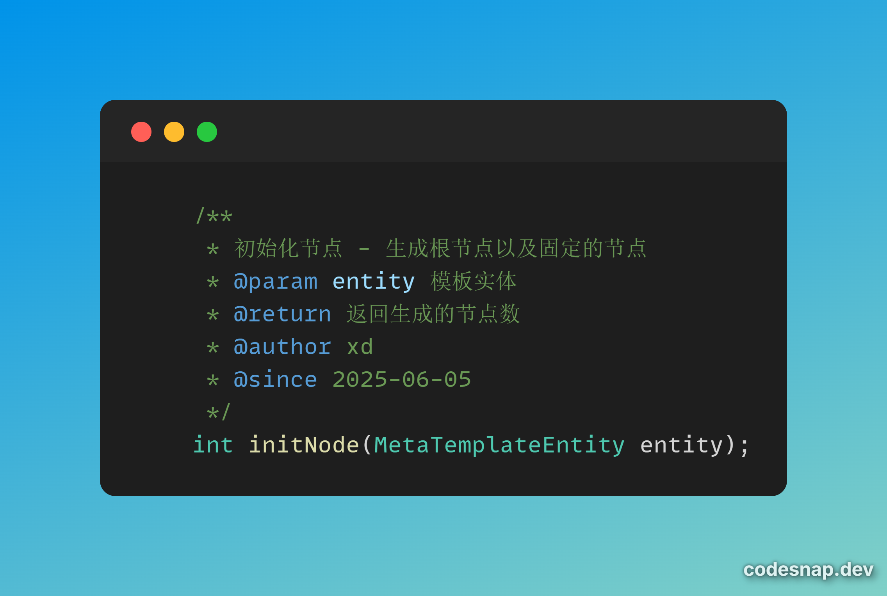
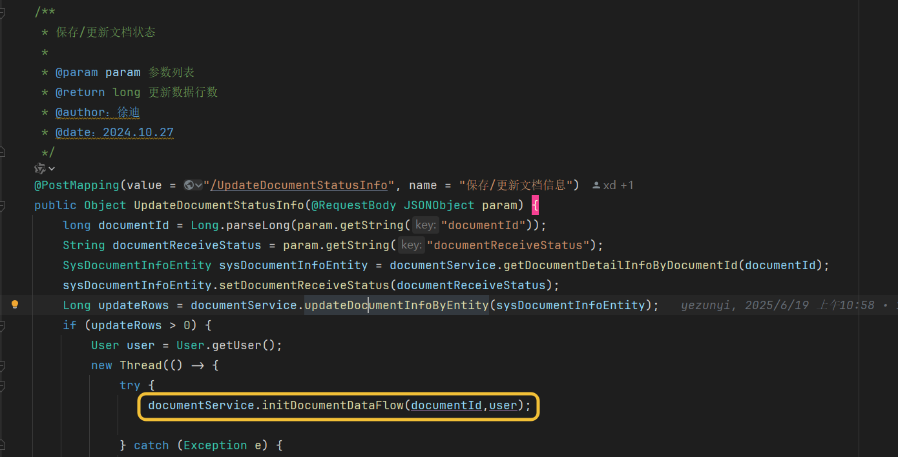

# 系统概述

## 概述

档案现在的目录结构如图所示:

### 业务配置模块

1. 业务配置下五个模块，其中正则表达式是相对独立的，供后续校验字段信息用的，现在并没有实际应用，`checkRuleInfo`这个接口是用来校验正则的，提前准备好了，但并没使用

2. 剩下几个模块：字段构成列表/表单，列表/表单又构成模板，他们都是1对多的

3. 在这个页面，点暂保存或者预览的时候，这个模板对应的那套 `json` 才真正生成，而且只是骨架，并没有填值进去。

4. 一个模板对应很多节点，节点类型分为目录和列表/表单（所以这是一个很经典的树结构，自然而然的我们想到，可以用 `DFS` 来遍历树结构，从而维护这套 `json`）。 `generate4TemplateJSON` 这个接口是用来生成上述 `json`的，对于列表/表单，因为数据格式不一样，所以单独抽象出来了两个方法（ `generateDescripeData` 和 `generateGridData`）来生成对应的数据。并且，在生成 `gridData`的时候， `header` 也是单独拎出来的。

5. 因为业务需要，前端传给后端的 `json` 和后端给前端的 `json` 其实是有一些差异的，所以又抽象出来了两个方法：
    - ` convert2TemplateJson`: 将前端传的JSON转换为符合标准的JSON
    - `convert2OutputJson`: 将档案系统的JSON转化为前端需要的json

6. 由于起初写 `json` 生成的接口的时候自然而然的想到了用单调栈，导致后续出现乱序问题，为了解决这个问题，又有了 `pageDataSortUtil` 这个排序的工具类，可以参考这个接口：

### 档案录入 && 档案接收

1. 上文提到，模板管理生成的 `json` 只是一个骨架，而这里就是往里面填充数据的过程。需要注意的是：虽然这里是从模板那张表里面取 `json` ，但写的时候是写到 `sysDocument`表中的

### 电子档案查阅申请

- 这里分为两部分，发起申请和历史记录，历史记录部分的后端接口是左之星负责的，这里不作叙述

- 对于发起申请部分：

因为想要实现的是“动态参数查询”，但是又把一些东西拎出来作为固定的东西了，因此这个界面上下两部分分别对应不同的接口，之后再结合在一起调 `queryFormListByDocumentType` 接口，从而返回对应的 `document`数据

又及，“固定”类型的表单、字段是维护好的，并且在创建模板的时候就已经挂到对应的模板下面了，对应这个接口

- 需要着重强调的是：在更新/保存文档信息的时候，我们调了 `initDocumentDataFlow` 这个接口。
这个接口用来反向解析上述那套 `json`，因此在查档的时候，我们其实查的是 `field_data`这张表的数据。

## 地址

- 原型地址：http://172.16.0.59/档案管理系统/云档案管理系统/V1.1.1

- 档案测试环境：https://c.nenggongshe.com/DxDocumentAdmin/#/home

- 生产环境： https://www.dxsz.cn/DxDocumentAdmin/#/login

- 演示环境1：https://one.dxsz.cn/DxDocumentAdmin/#/login

- 演示环境2： https://two.dxsz.cn/DxDocumentElevatorAdmin/#/login